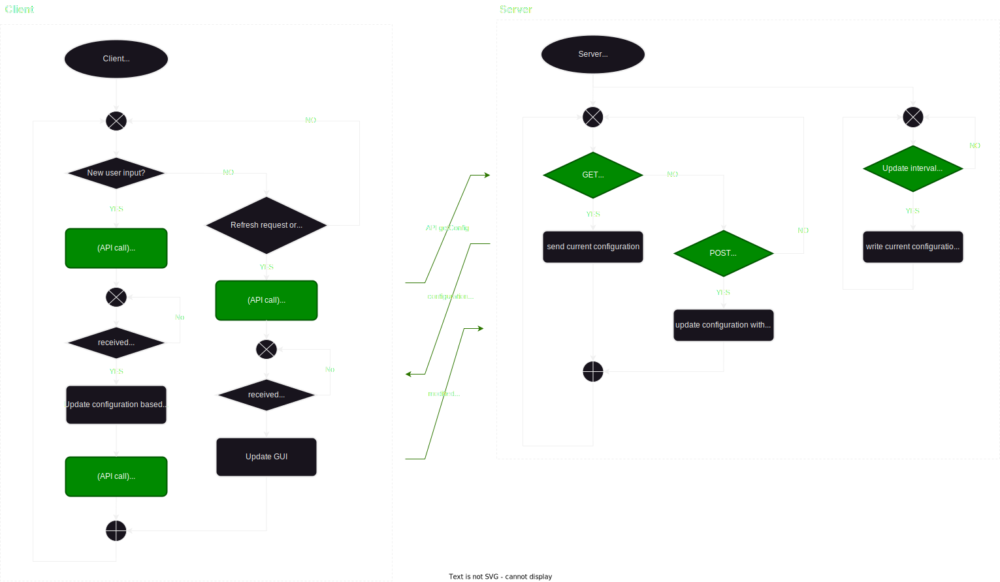

# CarbageRunSystemV2

<p align="center">
  

</p>


<p align="center">
  
  
  
</p>


## Abstract
Jedes Jahr findet der Carbage Run, eine der größten "Schrott" Rallys in Europa, im Spätsommer statt. 

[Carbage Run](https://www.carbagerun.de/)
>Bei Europas größter und abgefahrenster Autorallye erwartet dich ein fünftägiges Abenteuer durch verschiedene Länder, und das in einem Auto, das nicht mehr als 1.000 Euro kosten darf. Erstmals 2009 in den Niederlanden gestartet, ist der Carbage Run mittlerweile ein länderübergreifendes Event mit hunderten begeisterten Teilnehmern. 

Viele Teilnehmer modifizieren ihre Fahrzeuge in dem sie neben kreativen Lackierung/Folierungen auch zusätzliches Equipment wie z.B. Warnleuchten oder Nebelhörner an ihre Fahrzeug anbringen. 

Die Zielsetzung des hier beschriebenen Systems ist es, eine drahtlose Ansteuerung des an meinem Carbage Run Auto (Audi) montierten Equipment von der Kommadozentrale (Mittelkonsole) aber auch von einem Smartphone zu ermöglichen.

Die zu steuerenden Elemente am Fahrzeug sind in den folgenden Tabellen aufgelistet  
### Lichtanlage
| Funktion | Beschreibung | Farbe |
| ----------- | ----------- | ----------- |
| ON; OFF; ggf. Modus | Warnbalken an Stirnseite des Dachträgers  | LED (Orange) |
| ON; OFF; ggf. Modus | Blitzerlicht in Kühlergrill  | LED (Orange) |
| ON; OFF; ggf. Modus | Warnbalken an Rückseite des Dachträgers  | LED (Orange) |
| ON; OFF | Rundumleuchte Links (noch nicht verbaut) | Halogen (Orange) |
| ON; OFF | Rundumleuchte Rechts (noch nicht verbaut) | Halogen (Orange) |
| ON; OFF | Arbeitsscheinwerfer/ Camping Lichter an Rückseite des Dachträgers  | LED (Weiß) |
| ON; OFF; ggf. Modus | Blitzerlicht an Rückseite von Dachträger  | LED (Orange) |

### Hornanlage
| Funktion | Beschreibung |
| ----------- | ----------- |
| ON; OFF | 95cm Druckluft horn von ehemaligen THW Fahrzeug | 
| ON; OFF | 70cm Druckluft horn von ehemaligen THW Fahrzeug | 
| ON; OFF | vierfach Druckluft (Zughorn)  | 
| ON; OFF | kurzes Druckluft 1 von 6  | 
| ON; OFF | kurzes Druckluft 2 von 6  | 
| ON; OFF | kurzes Druckluft 3 von 6  | 
| ON; OFF | kurzes Druckluft 4 von 6  | 
| ON; OFF | kurzes Druckluft 5 von 6  | 
| ON; OFF | kurzes Druckluft 6 von 6  | 

## Allgemeine Funktionsweise der Applikation
Das System verkörpert ein klassisches Server Client Model. Als Server wird ein am Dachträger montierter Raspberry eingesetzt, der neben Webserver auch als Wifi Router/Accesspoint agiert. 
Zugriff auf den Server ist innerhalb des Wifi Netzes möglich. 
Als primärer Client wird ein zweiter Raspberry verwendet, der als Kommandozentrale in der Mittelkonsole des Fahrzeugs eingesetzt wird. Auf diesem wird eine Pyside2 basierte Applikation eingesetzt, die die API Zugriffe steuert. Für die Steuerung des System von einem weiteren mobilen Endgerät (Smartphone) ist die Webseite (Client Side) bestimmt. 


## Serverseitigen API Endpoints
die API lässt sich in zwei Bereiche einteilen.
- `/api/lights`
- `/api/horns`

Die Endpunkte beider Bereiche sind gleich aufgebaut und dienen dazu die folgenden Konfigurations Objekte im Server auszulesen oder zu modifizieren.

```javascript
const lights = {flasher_bar_front: '0',  // amber Light bar front of vehicle
		          flasher_bar_back: '0',   // amber Light bar back of vehicle
                flasher_grill: '0',      // amber flashers in radiator grill  
                flasher_roof_back: '0',  // amber flashers on the back of the roof 
                beacon_left: '0',        // rotating amber beacon left side
                beacon_right: '0',       // rotating amber beacon right side
                work_lights_front: '0',  // white working lights on the front of the roof
                work_lights_back: '0'};  // white working lights on the back of the roof

const horns = {thw_low_tone: '0',            // long low tone air horn
	            thw_high_tone: '0',           // long high tone air horn
               quadruple_horn: '0',          // quadruple air horn (train horn sound)
               melodiy_horn_1: '0',          // longest of melodiy air horns 
               melodiy_horn_2: '0',          // ---
               melodiy_horn_3: '0',          // ---
               melodiy_horn_4: '0',          // ---
               melodiy_horn_5: '0',          // ---
               melodiy_horn_6: '0',          // shortest of melodiy air horns
               
               sequencer_melody: [],         // melodiy encoded in array
               sequencer_horns: '0'};        // acticate sequencer thats plays sequencer_melody with the air horns
```

|HTTP Verb| Endpoints | Beschreibung|
|------|-----|-----|
|GET|`/api/{Bereich}/getAll`| lese Konfigurations Objekt|
|GET|`/api/{Bereich}/getKeys`| erhalte alle Key Strings des Konfigurations Objekts|
|GET|`/api/{Bereich}/getValue/:key`| lese Wert einer Variable `key` im Konfigurations Objekt|
|POST|`/api/{Bereich}/setValue/:key`| schreibe neuen Wert in Variable `key` im Konfigurations Objekt|
|POST|`/api/{Bereich}/setConfig`| überschreibt alle Wert im Konfigurations Objekt|

Die APi verwenden das JSON format und sendet entweder Teilauschnitte oder das gesamte JSON Konfigurations Objekt zum Client. Gleichzeitig müssen POST Request des Client auch das selbe Format wie die hier gezeigten Konfiguration objekte aufweißen.


## Beschreibung des Source Codes und Funktionsweise des Clients
Die Client seite wurde Event basiert bzw. allein aus Callbacks aufgebaut. Der normale Ablauf ist wie folgt:
1. Nutzer betätigt "toogle" bei beliebigen Element um die Konfiguration zu ändern. Callback / Handler funktion wird aufgerufen.
2. Client ließt aktuelle Konfiguration vom Server (single source of truth) (GET)
3. Client modifiziert die Konfiguration
4. Client sendet neue Konfiguration zum Server. (POST)  

Die automatische "Refresh" Funktion beider Bereiche ist eine Ausnahme, in dem Sie durch ein Timer ausgelöst wird. Diese wird benötigt, das Änderungen von anderen Clienten nachverfolgt werden können. 

Die Steuerung ist auch mit mehreren Clients möglich, selbst wenn einer der clients schon länger kein Update durchgeführt hat. Aus dem Grund, dass bei einer Änderung immer zuerst die aktuelle Konfiguration aus dem Server gelesen wird, bevor die Änderung eingefügt wird. 
Die Funktion dient daher allein das visuell die selbe Konfiguration auf inaktiven clients angezeigt wird, wie sie auch auf dem Server aktiv ist.



## Abbildung Clientseite 


## Installation/ Inbetriebnahme

1. Raspberry Pie mit beliebigen Wifi netz verbinden oder als eigenen Hotspot konfigurieren
    - IP - Addresse muss ggf. in `/server/index.js` angepasst werden. Standard konfiguration nutzt 192.168.0.114 und Port 3000

2. Clonen von Projekt Repository in Home Verzeichnis
    - `git clone https://github.com/RichysStuff/CarbageRunSystemV2.git`

3. Installation von node js auf Raspberry Pi (Server) 
    - [Anleitung WLW Modul](https://wlw.pages.fhnw.ch/web/01-setup/index.html)

4.  Server starten
    - `cd ~/CarbageRunSystemV2/server`
    - `node index.js`

5. Client starten
    - `~/CarbageRunSystemV2/client/index.html` mit Browser öffnen
    - Server adresse und Port ggf. anpassen
